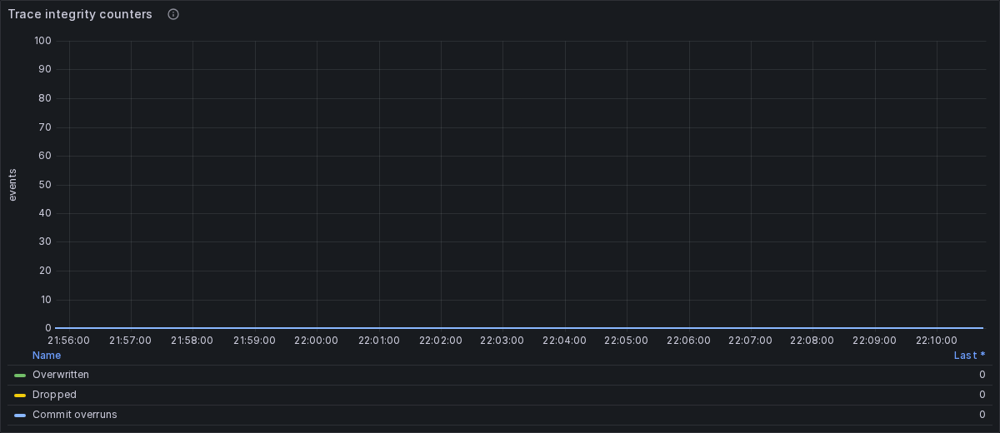
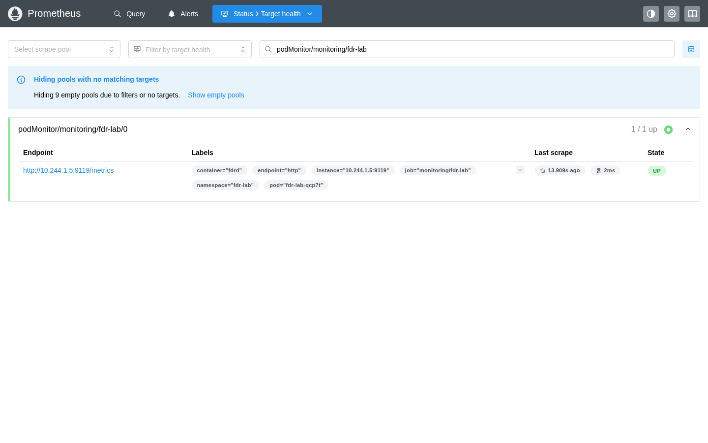

# Live Kind observation

- Status: **PASS**
- Observation: 2026-08-29T21:09:42Z
- Source commit: `ec40e3e0f5fdfa44ca8e87c3b66bc9e980286bca`
- FDR image: `fdr-lab:dev`, built from the working tree
- Host kernel: `7.1.8-100.fc43.x86_64`
- Pod: `fdr-lab-qcp7t`
- Observation window: 15 minutes

This follow-up records an ordinary live period after the Kind lab had remained
running. It does not introduce a bad probe, kill a collector, or deliberately
overload tracefs.

## Observed state

| Signal | Observation |
|---|---:|
| Prometheus target | `1 / 1 up` |
| FDR readiness | `1` |
| Configured instances | `1` |
| Live workers | `1` |
| Bytes written | `2,532,343,039` |
| Rotations | `150` |
| Storage-protection drops | `0` |
| Probe failures | `0` |
| Write errors | `0` |
| Trace overruns | `0` |
| Tracefs dropped events | `0` |
| Commit overruns | `0` |

The nonzero bytes and rotations show that the collector was active throughout
the observation. The zero integrity counters and ready state show that FDR and
tracefs reported no known loss during that interval. This is an operational
observation, not a performance qualification.

## Focused screenshots

The screenshots deliberately avoid a composed evidence poster. Each image is a
direct browser capture of one authoritative operational surface.

### Grafana trace integrity

The three plotted series are overwritten events, dropped events, and commit
overruns. Each legend value is zero.

### Prometheus target health

The filtered target page identifies pod `fdr-lab-qcp7t`, endpoint `:9119`, and
state `UP`.

## Retained records

- [Integrity metrics](metrics.txt)
- [Environment](environment.txt)

## Scope

Kind shares the Fedora host kernel, so this is not independent-node isolation.
The systemd FDR service running on the workstation is separate from this
Kubernetes target. This observation proves only the stated healthy interval;
the automated [lifecycle report](../2026-08-29-kind-kernel-7.1.8/report.md)
contains the degraded-state, recovery, rotation, and cleanup checks.
