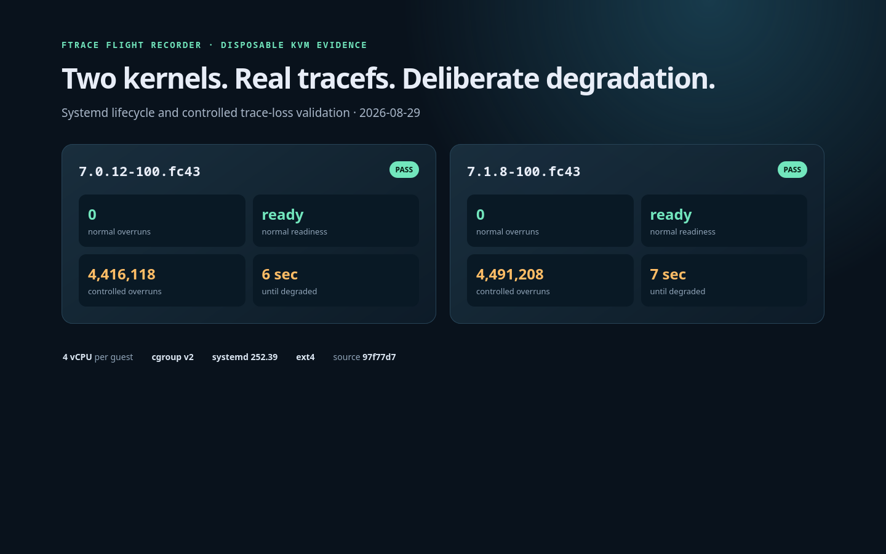

# Disposable-VM kernel and controlled-loss validation

Date: 2026-08-29  
Source commit: `97f77d758ada36002476ccc7fd0f053bb69d39f3`  
Harness: `tests/vm/local-kernel-matrix.sh`  
Result: **PASS**

## Results

| Kernel | Normal readiness | Normal overruns | Rotations | Controlled overruns | Degraded after | Result |
|---|---:|---:|---:|---:|---:|---|
| `7.0.12-100.fc43.x86_64` | 1 | 0 | 32 | 4,416,118 | 6 s | PASS |
| `7.1.8-100.fc43.x86_64` | 1 | 0 | 36 | 4,491,208 | 7 s | PASS |

Both KVM guests used four virtual CPUs, cgroup v2, an ext4 root filesystem,
and systemd 252.39. The normal scenario captured real `sched_switch` and
`sched_wakeup` events, accepted a valid reload, rejected an invalid reload
without losing readiness, restarted after collector termination, rotated
regular mode-0600 files, reported zero trace loss, and removed its trace
instance during shutdown.

The controlled scenario applied `CPUQuota=1%`, reduced the trace buffer to
64 KiB per CPU, enabled scheduler and raw-syscall events, and generated
fork/exec pressure for 35 seconds. Both kernels exposed trace overruns through
Prometheus and changed `fdr_ready` to `0`; this is the required degraded-state
behavior.

Compact raw evidence is retained under [`7.0.12/`](7.0.12/) and
[`7.1.8/`](7.1.8/). The generated matrix output is in
[`matrix-report.md`](matrix-report.md).

## Scope and remaining qualification

This run proves the disposable-VM mechanics, systemd behavior, two installed
kernel builds, and controlled trace-loss reporting. It does **not** claim the
full release matrix is complete:

- the oldest and current Ubuntu LTS cloud-image profiles still need recorded
  passes;
- the Noble single-node k3s profile still needs a recorded pass;
- full performance characterization still needs baseline overhead, event-rate
  and buffer-size curves, and retention/disk-pressure measurements.

The official-image harness for those checks is implemented in
`tests/vm/matrix.sh`. Its cloud images are checksum verified, its Noble profile
pins k3s `v1.35.5+k3s1`, and failed guest overlays are retained for diagnosis.
